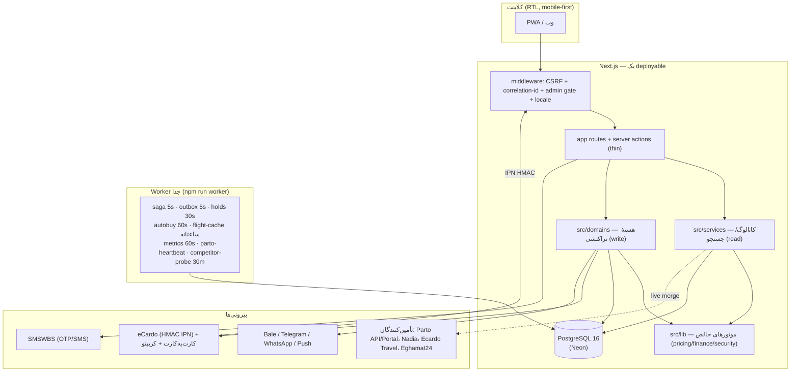
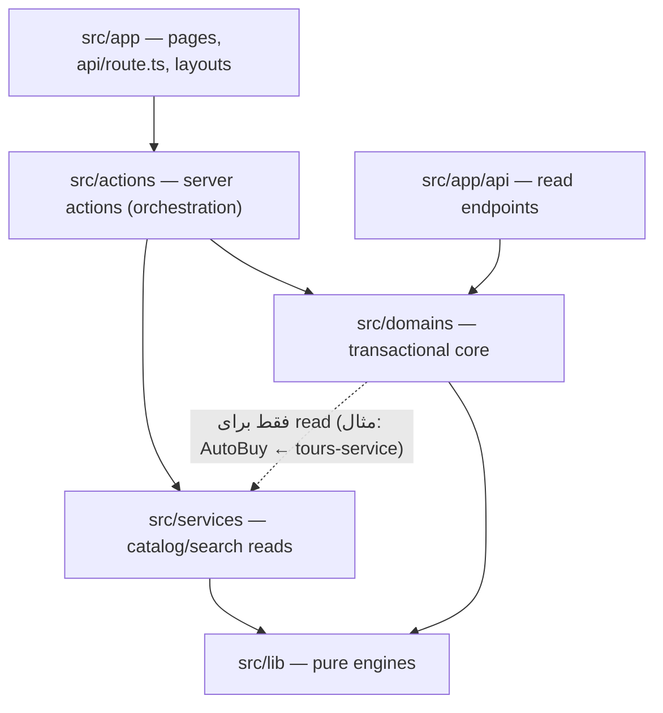
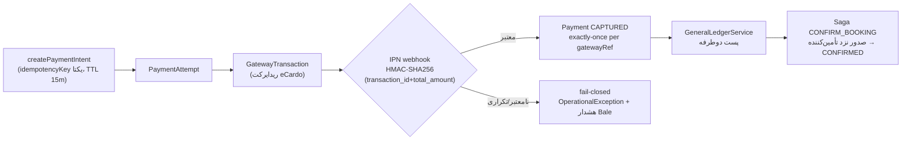

# معماری مرجع فیروزو — Firuzo Canonical Architecture

**نسخه:** 1.4 — تاریخ: 2026-09-19 — هماهنگ با `itrip-platform@1.8.4`
**جایگاه:** این سند، مرجع رسمی و تک‌منبع حقیقت (Single Source of Truth) معماری پلتفرم است. هر تغییر معماری باید اول در همین سند ثبت شود، بعد در کد پیاده شود.

> 🎯 هدف این سند: هر ایجنت یا هم‌تیمی، بدون خواندن ۱۰۰ فایل، بداند «ساختار چیست، کجا چه چیزی است، کدام قانون را نباید بشکند، و کجا مرجع تخصصی‌تر پیدا کند.»

---

## فهرست

- [§0 — ترتیب وثوق اسناد (کِی به کجا رجوع کنیم)](#0)
- [§1 — قانون‌های طلایی (هرگز نقض نشود)](#1)
- [§2 — چشم‌انداز و اهداف محصول](#2)
- [§3 — استک فنی](#3)
- [§4 — تصویر کلان: Modular Monolith](#4)
- [§5 — قانون لایه‌بندی و جهت وابستگی‌ها](#5)
- [§6 — نقشه دامنه‌ها (22 Domain)](#6)
- [§7 — مدل داده (78 مدل Prisma)](#7)
- [§8 — ناگفتنی‌های هستهٔ تراکنشی (Invariants)](#8)
- [§9 — معماری تأمین‌کنندگان (Suppliers)](#9)
- [§10 — قیمت‌گذاری و پول](#10)
- [§11 — هویت، RBAC و KYC](#11)
- [§12 — لایه API و قراردادها](#12)
- [§13 — معماری فرانت‌اند](#13)
- [§14 — گیت‌های کیفیت و تست](#14)
- [§15 — استقرار و محیط‌ها](#15)
- [§16 — مشاهده‌پذیری و عملیات](#16)
- [§17 — امنیت](#17)
- [§18 — نقشه پوشه‌ها](#18)
- [§19 — شکاف فعلی و مسیر پیش‌رو](#19)
- [§20 — تصمیم‌نامهٔ معماری (ADR)](#20)
- [§21 — توافق‌های کاری تیم](#21)
- [§22 — نقشهٔ کامل اسناد](#22)

---

<a name="0"></a>
## §0 — ترتیب وثوق اسناد

وقتی بین اسناد تعارض دیدی، این ترتیب ملاک است:

| سؤال | مرجع نهایی |
|---|---|
| «ساختار/قوانین معماری چیست؟» | **همین سند** (`docs/ARCHITECTURE.fa.md`) |
| «الان واقعاً چه چیزی کار می‌کند و چه چیزی demo است؟» | `docs/baseline/FEATURE_REALITY_MATRIX.md` (رقم‌ها حرف می‌زنند، نه ادعاها) |
| «جزئیات تخصصی یک دامنه (booking/payment/ledger/inventory/ERP)؟» | اسناد Sep-5 ریشه: `BOOKING_LIFECYCLE.md`، `PAYMENT_FLOW.md`، `ACCOUNTING_MODEL.md`، `INVENTORY_CONCURRENCY.md`، `ERP_OPERATIONS.md` |
| «قواعد کدنویسی UX/i18n/a11y؟» | `AGENTS.md` (ریشه) — lint و اسکریپت‌ها آن را enforce می‌کنند |
| «زبان بصری/توکن‌های دیزاین؟» | `DESIGN.md` + `src/app/globals.css` |
| «راه‌اندازی و وضعیت تأمین‌کنندهٔ خاص؟» | `docs/PARTO_LIVE_INTEGRATION_PLAN.fa.md`، `docs/NADIA_CRS_INTEGRATION.fa.md`، `docs/ECARDO_TRAVEL_INTEGRATION.fa.md`، `docs/AUTH_PROVIDERS_SETUP.fa.md` |
| «عملیات اضطراری (webhook، ledger، saga)؟» | `docs/runbooks/*` |
| «خروجی v2.0 و وضعیت QA؟» | `HANDOFF.md` |

**قاعدهٔ تعارض کد و سند:** کد + تست سبز = حقیقت لحظه‌ای؛ سند = حقیقت مطلوب. اگر کد با این سند فرق دارد، یکی از دو تا را همان روز اصلاح کن (سند یا کد) — اجازه نده فاصله جمع شود.

---

<a name="1"></a>
## §1 — قانون‌های طلایی (هرگز نقض نشود)

این ۱۲ قانون شناسنامهٔ پلتفرم‌اند. هر PR / هر session باید با آن‌ها سازگار باشد:

1. **قیمت فقط سروری است.** کلاینت هرگز قیمت محاسبه نمی‌کند؛ قبل از پرداخت همیشه `repriceBooking` سروری اجرا می‌شود و `PriceSnapshot` immutable ثبت می‌گردد.
2. **موفقیت پرداخت فقط با IPN امضاشده.** فقط webhook با `HMAC-SHA256` معتبر معیار capture است؛ redirect callback و state محلی هرگز معیار موفقیت نیستند (PAY-103).
3. **پول = Decimal.** هیچ محاسبهٔ مالی با float/mmb числа JS. گرد کردن IRR به نزدیک‌ترین ۱۰٬۰۰۰ ریال.
4. **Fail-closed در همهٔ دروازه‌ها.** احراز هویت، پرداخت، تأمین‌کننده، ERP: در نبود credential/سیاست، «رد کن» نه «باز کن». تولید با `DEMO_MODE=true` در build می‌ترکد (CI-012).
5. **وضعیت‌ها فقط از طریق state machine.** هیچ نوشتن مستقیم status string ممنوع؛ همیشه `assertTransition` روی هر چهار محور booking.
6. **پول‌یاری = Idempotent.** هر عملیات مالی با `idempotencyKey` (پرداخت) یا `groupId` یکتا (ledger) و exactly-once.
7. **لایه‌بندی §5 خط قرمز است.** components هرگز prisma import نمی‌کنند؛ domains هرگز به بالا (app/components/stores) import نمی‌کنند (BASE-006، enforced در eslint).
8. **RTL با logical properties.** فقط `start-/end-/ms-/me-/ps-/pe-`؛ هرگز `left/right/ml/mr/pl/pr`. آیکن‌های جهتی با `rtl:rotate-180`؛ media/checkmark هرگز flip نمی‌شوند.
9. **هر رشتهٔ کاربرمقیم، دوزبانه.** یا next-intl key (پاریتی ۱۰۰٪ ۵ زبانه با `gate:i18n`) یا inline `lt()` با پوشش ۵ زبانه (`gate:i18n-lt`).
10. **Touch target ≥44×44** و CTA تبدیل در thumb-zone (sticky bottom bar) — `AGENTS.md`.
11. **Secrets هرگز در repo.** repo عمومی است؛ قبل از هر `git add` secret-scan (gitleaks در CI هم هست). SMSWBS/Parto credentialها فقط env.
12. **گیت‌ها ۱۰۰٪ سبز قبل از commit** (§14) و واقعیت ادعاها در `FEATURE_REALITY_MATRIX.md` آپدیت شود.

---

<a name="2"></a>
## §2 — چشم‌انداز و اهداف محصول

**فیروزو (Firuzo)** ابراپ سفر ایرانی است: پرواز داخلی، هتل، تور، تجربه‌ها + خدمات جانبی (eSIM، بیمه، ویزا، ترانسفر، قطار، city-pass، اسنپ) + هوشمندساز سفر (AI Planner) + کیف پول چندارزی + ERP اپراتوری.

سه ستون تصمیم‌گیری:

| ستون | معنا | اثر معماری |
|---|---|---|
| **Mobile-first** | ۸۰٪+ ترافیک موبایل ایران؛ thumb-zone، bottom sheet، safe-area | §13؛ کلاس‌های `mobile/`؛ Sheet انتهایی |
| **Trust-first (REAL not DEMO)** | هیچ ادعای دروغ؛ هر ویژگی یا واقعی است یا برچسب صادقانه دارد | fail-closed §17؛ reality matrix؛کانال‌های `SIM vs LIVE` |
| **Earnings-grade integrity** | پول و انباری که اشتباه نمی‌شود | invariants §8؛ ledger double-entry؛ concurrency tests |

---

<a name="3"></a>
## §3 — استک فنی

| لایه | تکنولوژی | نسخه |
|---|---|---|
| Framework | Next.js (App Router) | 16.3.4 |
| UI | React + TypeScript | 19.2 / TS 5 |
| استایل | Tailwind CSS **v4** (CSS-first، بدون tailwind.config؛ توکن‌ها در `globals.css` `@theme`) | 4 |
| i18n | next-intl (5 زبانه: `fa` پیش‌فرض، `en/ar/zh/ru`) + دوزبان‌سازی inline `lt()` | 4 |
| State | Zustand 5 (persist) — **بدون TanStack Query** | 5 |
| فرم/ولیدیشن | react-hook-form + zod 4 | — |
| Auth | NextAuth v5 beta (JWT strategy + permissions در token) | beta |
| DB/ORM | PostgreSQL 16 + Prisma (تولید: Neon، دایرکت URI، `connection_limit=5`، بدون PgBouncer) | Prisma 5 |
| Worker | فرایند جدا با `tsx src/workers/worker-entrypoint.ts` (خارج از Next) | — |
| تست | Vitest 4 (co-located) + Playwright (chromium + mobile-chromium, workers=1) | — |
| استقرار | Vercel (region `fra1`) + cronها؛ مسیر جایگزین self-host: Docker/k8s | — |
| Observe | logger ساختاریافته + AlertingService + Exception Center + PostHog/Vercel Analytics | — |

---

<a name="4"></a>
## §4 — تصویر کلان: Modular Monolith

یک deployable قابل Next.js + یک فرایند Worker جدا. نه microservice.



**چرا Worker جدا؟** فراخوانی‌های طولانی HTTP (تأمین‌کننده، شماره‌گذاری بلیت، پرداخت) هرگز داخل transaction بزرگ DB اجرا نمی‌شوند؛ Saga/Outbox آن‌ها را به فرایند worker منتقل می‌کند و crash-recovery دارد.

---

<a name="5"></a>
## §5 — قانون لایه‌بندی و جهت وابستگی‌ها

**جهت مجاز وابستگی (بالا به پایین):**



| پوشه | نقش | مجاز import | غیرمجاز |
|---|---|---|---|
| `src/lib/` | موتور خالص و بی‌framework: `pricing/engine`، `finance/Money`، `money.ts`، `security/*`، `observability/*`، کاتالوگ استاتیک (`data.ts`، `cities.ts`، `countries.ts`)، `kyc-wizard.ts`، `prisma.ts` | — (به‌جز `prisma.ts` singleton) | نوشتن booking/payment |
| `src/services/` | **read-path** جستجو: `flights-service`، `hotels-service` (استاتیک + merge زندهٔ Ecardo/Nadia)، `tours-service`، `sim-service`، `flight-cache-service` | lib + adapterهای supplier | هر نوشتن وضعیت تراکنشی |
| `src/domains/` | **write-path** تراکنشی: state machine، saga، ledger، inventory، payments | lib، services (فقط read) | import از app/components/actions/stores/hooks (BASE-006) |
| `src/actions/` | server actionها؛ orchestration و زود-validation (zod) | domains، services، lib | business logic سنگین |
| `src/app/` | routing، rendering، روت‌های API | همهٔ پایین‌دست | — |
| `src/components/` | UI | stores، hooks، lib (فرمت/فرانت) | **هرگز `prisma` مستقیم** (BASE-006) |

**ESLint آن را enforce می‌کند** (`eslint.config.mjs`): قواعد BASE-006 برای domains و components. اگر eslint گریز ناپذیر خطا داد، معماری را درست کن نه قانون را.

---

<a name="6"></a>
## §6 — نقشه دامنه‌ها (22 Domain)

`src/domains/` — هستهٔ تراکنشی. جدول کامل:

| Domain | مالکیت | فایل‌های کلیدی |
|---|---|---|
| `ai` | روتینگ AI، ERP copilot، MCP tools، grounding پلنر | `AiRouterService.ts`، `ErpCopilotService.ts`، `travel-mcp-tools.ts` |
| `analytics` | تحلیل مالی و SLA عملیاتی | `FinancialAnalyticsService.ts`، `OperationalSlaAnalyticsService.ts` |
| `autobuy` | موتور قواعد خرید خودکار (saga + ledger + کاتالوگ) | `AutoBuyDomainService.ts` |
| `booking` | چرخهٔ رزرو، سبد، مسافران، coordinator سگا | `BookingApplicationService.ts`، `state-machine.ts`، `UnifiedCartService.ts`، `saga/BookingSagaCoordinator.ts` |
| `content` | انتشار CMS، SEO، ترجمهٔ محتوا | `CmsPublishingService.ts`، `SiteContentService.ts`، `SeoMetadataService.ts` |
| `currency` | نرخ ارز (FX_LIVE_SOURCE: fxapi→tgju→static) | `CurrencyService.ts`، `DynamicCurrencyCalculator.ts` |
| `erp` | فایل سفر، اسناد، **Exception Center** | `TravelFileService.ts`، `ExceptionCenterService.ts`، `ExceptionRemediationService.ts` |
| `events` | Outbox consumer، leases، اعلان‌ها (Bale/Telegram/WhatsApp/SMS/Email) | `OutboxConsumer.ts`، `WorkerLeaseService.ts`، `providers/*` |
| `finance` | فاکتور، کمیسیون، تسویه، سه‌طرفه | `InvoiceDomainService.ts`، `SettlementDomainService.ts`، `three-way-reconciliation.ts` |
| `identity` | RBAC رابطه‌ای، tenancy، Customer360، مسافران | `permission-service.ts`، `TenantRepository.ts`، `Customer360Service.ts` |
| `inventory` | hold/allotment، concurrency، انقضا | `InventoryEngine.ts`، `hold-state-machine.ts`، `HoldExpirationWorker.ts` |
| `ledger` | دفتر کل دوطرفه، ژورنال، invariants | `GeneralLedgerService.ts`، `JournalService.ts`، `LedgerInvariantValidator.ts` |
| `loyalty` | streak وفاداری (concurrency-safe) | `LoyaltyStreakService.ts` |
| `notify` | web-push | `PushDispatchService.ts` |
| `payments` | چرخهٔ PaymentIntent، درگاه‌ها، کیف پول، حالت real/demo ادمین | `PaymentDomainService.ts`، `gateway-port.ts`، `adapters/EcardoGatewayAdapter.ts`، `admin-payment-mode.ts` |
| `pricing` | PriceSnapshot، Quote، rate plan، competitor probe | `PriceSnapshotDomainService.ts`، `QuoteStateMachine.ts`، `competitor-probe.ts` |
| `referral` | کد معرف، کمیسیون لیدر | `ReferralDomainService.ts`، `LeaderCommissionService.ts` |
| `refund` | state machine استرداد و تسویه | `RefundDomainService.ts`، `RefundStateMachine.ts` |
| `risk` | ارزیابی ریسک | `RiskAssessmentService.ts` |
| `supplier` | پورت‌ها، adapterها، transport، circuit breaker، session monitor | `SupplierTransport.ts`، `adapters/*`، `PortalSessionMonitor.ts` |
| `trips` | تسهیم هزینهٔ سفر | `ExpenseSplitterService.ts` |

پشتیبانی: `src/stores/` (Zustand: `auth-store`، `booking-store`، `country-store`)، `src/hooks/`، `src/workers/`، `src/lib/observability/`.

---

<a name="7"></a>
## §7 — مدل داده (78 مدل Prisma)

`prisma/schema.prisma` — PostgreSQL، **هیچ enum در DB نیست**؛ همهٔ status ها `String` هستند و مقادیر مجاز در state machine های TypeScript (`src/domains/*/…-state-machine.ts`) نگه‌داری می‌شوند. این یک ADR است (ADR-002): migration وضعیت‌ها بدون DDL، در TS با `assertTransition`.

گروه‌های مدل:

| گروه | مدل‌ها |
|---|---|
| هویت/سازمان/KYC (11) | `User`، `Organization(+Branch/Membership)`، `TravelerProfile`، `TravelDocument`، `Role/Permission/RolePermission/UserRole`، `OtpVerification` |
| سفر/رزرو (5) | `Trip (TRP-…)`، `Booking (ITR-…)`، `BookingItem`، `BookingStatusHistory`، `PriceSnapshot` |
| پرداخت (9) | `PaymentIntent (idempotencyKey یکتا)`، `PaymentAttempt`، `GatewayTransaction`، `WebhookEvent`، `Payment (legacy، با paymentIntentId وصل)`، کارت‌های مقصد و رسیدها (`DestinationBankCard`، `CardTransferReceipt`، `DestinationCryptoWallet`، `CryptoPaymentReceipt`) |
| استرداد (5) | `Refund (RFD-…)`، `RefundPolicySnapshot`، `RefundApproval`، `RefundAttempt`، `RefundItem` |
| فاکتور/تجاری (4) | `Invoice(+Line)`، `CommissionRule`، `SettlementBatch` |
| دفتر (5) | `ChartOfAccounts`، `JournalEntry(+Line)`؛ کیف پول/دوطرفه: `Account` (unique `[ownerType, ownerId, currency]`؛ sentinel‌های `#platform`: ESCROW/FEE/REVENUE/GATEWAY_SETTLEMENT/SUPPLIER_PAYABLE/TAX_PAYABLE) + `LedgerEntry` (groupId جفت بدهکار/بستانکار، fxRate) |
| تأمین‌کننده/انبار (9) | `Supplier`، `SupplierConnection/Credential(vault)/Health/Statement/Contract`، `InventoryItem`، `Allotment (unique [item,date])`، `InventoryHold` |
| کش پرواز/تقاضا (3) | `FlightOfferCache`، `FlightRouteDemand`، `CompetitorPriceSnapshot` |
| اعتماد/عملیات/لاگ (7) | `AuditLog`، `OutboxEvent`، `SagaExecution/Step`، `WorkerLease`، `OperationalException`، `SystemErrorLog` |
| مالیات (2) | `TaxJurisdiction`، `TaxRule (versioned)` |
| محتوا/CMS (8) | `Tour(+DepartureDate/ItineraryDay)`، `SignatureExperience`، `Travelogue`، `GuideArticle`، `SiteContent (تنظیمات ران‌تایم ادمین: key/payload)`، `DeletedStaticRef` |
| معرف (3) | `ReferralCode`، `BookingReferral (1:1)`، `LeaderSettlement` |
| اتوماسیون/AI (4) | `AutoBuyRule`، `AssistantConversation/Message`، `PushSubscription` |
| پشتیبانی/تیکت (2) | `SupportTicket`، `TicketMessage` |
| تحلیل رفتار (1) | `BehaviorHeatmap` |

**زنجیرهٔ رابطهٔ هسته:**
`User → Booking(customerId, tripId?, organizationId?) → BookingItem[] → PaymentIntent → PaymentAttempt → GatewayTransaction` و `Booking → PriceSnapshot[] / Refund*`؛ جریان پول در `Account/LedgerEntry` توسط `GeneralLedgerService` ثبت می‌شود.

**وضعیت‌های اصلی (`Booking`)** — چهار محور مستقل:
- `status`: DRAFT → HELD → PENDING_PAYMENT → PAYMENT_CONFIRMED → CONFIRMING_SUPPLIER → CONFIRMED (+ CANCEL_*/REFUND_*/EXPIRED/FAILED) — ۱۴ گذار مجاز در `state-machine.ts`
- `paymentStatus`: INITIATED/AUTHORIZED/CAPTURED/FAILED/VOIDED/PARTIALLY_REFUNDED/REFUNDED (+PENDING_CUSTOMER در TS)
- `fulfillmentStatus`: PENDING/IN_PROGRESS/CONFIRMED/FAILED
- `ticketStatus`: NOT_ISSUED/ISSUING/ISSUED/VOIDED/REFUND_PENDING/REFUNDED

invariantهای بین‌محوری (`isConsistent()`، BOOK-107): مثلاً CONFIRMED بدون CAPTURED/AUTHORIZED ممنوع؛ ticket ISSUED فقط روی booking تأییدشده.

---

<a name="8"></a>
## §8 — ناگفتنی‌های هستهٔ تراکنشی (Invariants)

### 8.1 پرداخت — زنجیرهٔ کانونیکال



- **تنها معیار capture = IPN امضاشده** (`EcardoGatewayAdapter.verifyWebhook`). بدون endpoint verify جدا.
- `processWalletTopUpCapture`: intentهای شارژ کیف پول `bookingId = wallet_topup_<userId>`؛ ردِ mismatch مبلغ/ارز؛ اعتبار با `postTopUp`.
-_currency trap: پلتفرم IRR=تومان ↔ eCardo IRT (۱۰×) — تبدیل در adapter.
- درگاه‌های دیگر: `CardToCardPaymentAdapter` (رسید + بازبینی ادمین)، کریپتو (TRC20/BEP20/TON/ERC20 + تأیید on-chain با tron-verifier)، `InternalWalletGatewayAdapter`، `DemoPaymentAdapter` (فقط `!production && DEMO_MODE`).
- حالت پرداخت real/demo: global در `SiteContent` key `admin:payment_gateway_mode`، پیش‌فرض **real**؛ سوییچ ادمین‌only (`admin-payment-mode.ts`).
- `validateStartupPspConfig`: تولید بدون PSP credential بالا نمی‌آید.

### 8.2 دفتر دوطرفه
- `SUM(DEBIT) === SUM(CREDIT)` در هر ژورنال؛ `groupId` یکتا = idempotency ثبت؛ کیف پول با `SELECT … FOR UPDATE` روی `Account` ضد overdraft؛ imbalance > 0 = CRITICAL alert.
- سند مرجع: `ACCOUNTING_MODEL.md` + `docs/architecture/ledger-and-saga.md`.

### 8.3 انباری (Oversell = 0)
- `createHold`: `SELECT … FOR UPDATE` روی `Allotment` در `$transaction` + retry jittered (5x) روی P2034/deadlock.
- موجودی = `total − booked − Σ(holdهای ACTIVE غیرمنقضی)`؛ stop-sell محترم.
- capture/release قفل روی ردیف hold؛ sweeps با `updateMany` شرطی (idempotent).
- تست‌های رَس: `inventory-concurrency/capture-release-race/hold-race.test.ts` — gate جدا در CI (CI-104).
- سند: `INVENTORY_CONCURRENCY.md`.

### 8.4 Saga + Outbox + Lease
- `BookingSagaCoordinator` (SAGA-101..106): گام‌ها **قبل از اجرا** persist می‌شوند (inputSnapshot)، نتایج بیرونی در resultSnapshot، جبران reverse-order کاتالوگ‌شده، **صفر transaction باز هنگام HTTP بیرونی**، crash-safe.
- `OutboxConsumer`: claim با `WorkerLease` + `FOR UPDATE SKIP LOCKED`؛ بازیابی رویدادهای PROCESSING stale>2min؛ backoff + jitter؛ DLQ.
- `WorkerLeaseService`: lease توزیع‌شده با heartbeat + `recoverCrashedLeases()`.
- تست‌های crash-recovery در CI (CI-105).

---

<a name="9"></a>
## §9 — معماری تأمین‌کنندگان (Suppliers)

**الگو:** port (`flight-supplier-port.ts` / `hotel-supplier-port.ts`) → adapter → `SupplierTransport` مرکزی (timeout، retry محدود، circuit breaker، ثبت latency/health) → `SupplierNormalizer`.

**مدل سروِ پرواز = cache-first (ADR-005):** جستجوی کاربر هرگز مستقیم به تأمین‌کننده نمی‌رود:
1. `FlightRouteDemand` (۱۱ مسیر پرطرفدار seed؛ `bumpRouteDemand` روی هر جستجو)
2. worker/cron ساعتانه `refreshStaleRoutes` → upsert در `FlightOfferCache` (TTL با `expiresAt`، قفل refresh در هر process ضد stampede، بودجهٔ ۹s)
3. `overlayLiveFlights()` نتایج استاتیک را با ردیف‌های زنده + متادیتا freshness جایگزین می‌کند — **هرگز throw نمی‌کند**؛ بدون source کانفیگ‌شده، کاتالوگ استاتیک سرو می‌شود.

| Adapter | سرویس | فعال وقتی… | وضعیت فعلی |
|---|---|---|---|
| `PartoCrsApiClient` (+`PartoFlightSupplierAdapter`) | پرواز داخلی (API رسمی CRS) | `PARTO_CRS_ENDPOINT_URL/OFFICE_ID/USERNAME/PASSWORD` | credential-gated؛ pickup با پنل |
| `PartoPortalProvider` | fallback اسکرِیپ session-based همان پروازها | `PARTO_PORTAL_COOKIE/BASE_URL` + state file `.parto-portal-state.json` | gated؛ heartbeat `parto-session-heartbeat-worker` session را زنده نگه می‌دارد |
| `NadiaCrsClient` (+`NadiaHotelSupplierAdapter`) | هتل‌ها (aggregator) | `NADIA_CRS_USERNAME/PASSWORD/TOKEN/BASE_URL`؛ جستجو در prod با creds؛ **رزرو فقط با `NADIA_CRS_ENABLE_BOOK=true`** | جستجو آماده؛ رزرو gated (تا اکانت واقعی) |
| `EcardoTravelClient` | هتل/پرواز خارجی/eSIM (host whitelist + SSRF guard) | `ECARDO_TRAVEL_API_BASE/ORIGIN_SECRET` | live-verified |
| `EghamatHotelSupplierAdapter` | هتل‌ها | `EGHAMAT_API_KEY` + production | gated |
| `ProductionSmswbsProvider` | OTP/SMS ایران | `SMSWBS_USERNAME/PASSWORD/SENDER` | live (چرخش رمز هنوز pending!) |
| `ProductionBaleProvider` | هشدار عملیاتی | `BALE_BOT_TOKEN` | live |

پایش سلامت: `PortalSessionMonitor` → exception dedup‌شدهٔ `SUPPLIER_SESSION_EXPIRED` + پینگ ادمین در Bale؛ با برگشتن session، auto-resolve. `SupplierHealth` + `PredictiveSupplierRoutingService` برای انتخاب مسیر.

---

<a name="10"></a>
## §10 — قیمت‌گذاری و پول

**خط لولهٔ ۱۲مرحله‌ای سروری** (`src/lib/pricing/engine.ts`، PRICE-001/002):

```
1 هزینهٔ پایهٔ تأمین‌کننده → 2 کارمزد تأمین‌کننده → 3 markup نقش/محصول
(B2C 8%، B2B 3.5%، محصولی 5–14%) → 4 قاعدهٔ کانال → 5 قاعدهٔ مشتری/همکار
→ 6 کارمزد سرویس پلتفرم → 7 مالیات نسخه‌دار (TaxEngine؛ B2B 5%)
→ 8 پروموشن/تخفیف معرف (قواعد stacking) → 9 کارمزد روش پرداخت
→ 10 snapshot نرخ ارز → 11 گرد کردن (IRR→۱۰٬۰۰۰ ریال؛ FX→2dp)
→ 12 PriceSnapshotImmutable ثبت
```

- `src/lib/finance/`: `Money` (Decimal)، `MoneyBreakdown`، `FxSnapshot`، `roundForCurrency`.
- مالیات: `TaxEngine` از جداول `TaxJurisdiction/TaxRule` (jurisdiction IR/GLOBAL، پنجرهٔ اثربخشی، `ruleVersion`) با fallback استاتیک.
- VAT/کارمزد درگاه کشورمحور: `chargeContext(countryId)` در `lib/money.ts` (کشورهای VAT 5–20%، درگاه 0–2.5%)؛ شارژ کیف پول معاف.
- نمایش چندارزی: `useDisplayCurrency` + `CURRENCY_TO_TOMAN` (تک‌منبع UI).
- رقابت‌سنجی قیمت: `competitor-probe` gated با `COMPETITOR_PROBE_ENABLED`.

**قانون:** هیچ صفحه/کامپوننتی قیمت را «حساب» نمی‌کند — فقط نمایش snapshot سروری. اگر جایی محاسبهٔ قیمت client-side دیدی، باگ معماری است.

---

<a name="11"></a>
## §11 — هویت، RBAC و KYC

- **NextAuth v5** (`src/auth.ts`، JWT): provider Google + WeChat (×۲) + یک CredentialsProvider چندکاناله (password، otp، phone، email، telegram(+widget HMAC)، whatsapp، wechat، bale). OTP ایران مستقیم SMSWBS؛ کد OTP با HMAC هش‌شده در `OtpVerification` (TTL 5m، حداکثر ۵ تلاش؛ limiter 3/10min) + outbox event `AUTH_OTP_REQUESTED`.
- **RBAC رابطه‌ای، authority واحد:** `User → UserRole → Role → RolePermission → Permission` (legacy `User.role` فقط نمایش). JWT callback پرمیشن‌ها را در `token.permissions` می‌ریزد.
- سه‌لایهٔ اعمال دسترسی ERP: (۱) map پرمیشن مسیرها در middleware (fail-closed) ← (۲) gate سروری `hasErpRole` در `admin/layout.tsx` ← (۳) `requirePermission` در هر اکشن.
- **Tenancy:** `getTenantAuthContext` → `assertTenantAccess` (IDOR/cross-tenant guard)؛ `TenantRepository` scoper.
- **KYC = derived، نه ستونی:** هیچ ستون KYC روی User نیست. `isProfileComplete` (نام + nationalId یا passport) → `profileComplete`/`kycApproved` مشتق در `getSessionUser` و غیره. اکشن تکمیل: `updateProfileDetails`. checkout lead-passenger را gate می‌کند؛ ویزارد ۳مرحله‌ای در `KycCompletionSheet` + `lib/kyc-wizard.ts` (+checksum کد ملی).
- ورود anonymous تا checkout باز است؛ خرید gate کامل login دارد.

---

<a name="12"></a>
## §12 — لایه API و قراردادها

- **middleware (`src/middleware.ts`)** چهار کار: (۱) CSRF روی همهٔ mutationهای `/api` + `x-correlation-id` روی هر پاسخ؛ (۲) alias redirect `/login|signin` با open-redirect guard؛ (۳) gate پرمیشن ادمین از JWT؛ (۴) delegation به next-intl.
- **شکل پاسخ:** همهٔ route/actionها از `src/lib/api-response.ts` استفاده می‌کنند — `api-shape-scan.mjs` (0/25) تخلف را می‌گیرد.
- **هدرهای امن** در `next.config.ts`: CSP (با مجوز ecardo.ir/call widget)، HSTS، X-Frame DENY، `no-store` + noindex روی `/api/*`.
- **روت‌های API اصلی** (`src/app/api/`): `flights/search`، `hotels/search|/[id]`، `tours(+[id])`، `experiences`، `plan/refine`، `assistant/chat`، `payments/{callback,webhook,receipt-upload,ecardo/callback}`، `auth/[...nextauth]+telegram/callback`، `loyalty/*`، `push/subscribe`، `capabilities`، `cron/{auto-buy,flight-refresh}`، `admin/search`، `travel/bootstrap`، `version`، `health/{live,ready}`.
  - نکته: `/api/hotels` (بدون /search) 404 می‌دهد — مسیر درست `/api/hotels/search`.
- **Server actions** (`src/actions/`): booking، auth، admin(+admin-payment-mode، admin-exceptions)، content، travelers، trips، autobuy، organizations، operator، invoices، demo-payment، crypto-payments، finance-receipts.
- Idempotency: `createBookingDraft` با uuid key؛ webhookها با gatewayRef.

---

<a name="13"></a>
## §13 — معماری فرانت‌اند

### 13.1 روت‌ها (زیر `src/app/[locale]`؛ بدون root layout — همه زیر locale)

| مسیر | نقش |
|---|---|
| `/` | Home — server component؛ سکشن‌های `components/home/sections/*` با override از CMS |
| `/book` | هاب رزرو (کاشی‌های vertical + quick services) |
| `/flights`, `/flights/search` | فرود و نتایج پرواز (BentoFlightCard، مقایسه، تقویم قیمت) |
| `/hotels`, `/hotels/search`, `/hotels/[id]` | هتل‌ها (فیلترها + نقشه leaflet؛ detail با BookingPanel) |
| `/tours`, `/tours/[id]` | تورها (TourQuickBar sticky، ایتینراری) |
| `/plan` | **هوشمندساز سفر** — ویزارد ۷مرحله‌ای + `?q=` پارسر پرسش طبیعی + رفت‌وبرگشت |
| `/destinations`, `/travelogues/[id]` | راهنمای مقصد و بلاگ |
| `/checkout`, `/payment-status` | قیف خرید (۴ فاز) و وضعیت پرداخت |
| `/auth` | ورود همه‌کاناله |
| `/account` (+`travelers`، `organization`، `auto-buy`) | داشبورد کاربر |
| `/my-trips/[id]`, `/trips`, `/wallet`, `/invoices/[id]` | سفرها، کیف پول، فاکتور رسمی |
| `/esim /insurance /transfers /trains /visa /city-pass /snapp /services /guide /support /interpreter` | verticalهای جانبی |
| `/admin/*` | ERP (§13.5) |
| `/demo/ecardo-checkout` | درگاه شبیه‌سازی (فقط demo) |

### 13.2 Chrome و Providers
- `[locale]/layout.tsx`: `dir=rtl` برای fa/ar؛ فونت لوکال **IRANYekanXFaNum** (+Yekan Bakh fallback؛ en→Jakarta، ru/zh→Noto)؛ theme script pre-paint (`firuzo-theme`، بدون next-themes)؛ `viewportFit: cover`؛ JSON-LD.
- `providers.tsx`: **بدون SessionProvider/TanStack** — `SessionBootstrap` سشن را با `getSessionUser` در Zustand `auth-store` آب می‌کند.
- `AppChrome`: برای `/admin` فقط children+Toaster؛ وگرنه Header+Footer+**BottomNav**(5-tab؛ hidden در checkout/payment-status) + ContactDock + چت AI + PromoModal.

### 13.3 i18n دوگانه
1. next-intl — namespaceهای مشترک در `messages/{fa,en,ar,zh,ru}.json` (پاریتی ۱۰۰٪ با `gate:i18n`؛ ۸۵۶+ key).
2. inline `lt(locale, {fa,en,…})` برای کپی صفحه‌محلی (~170 فایل) — gate بودجه‌ای `gate:i18n-lt` (fallback: ar→fa→en؛ zh/ru→en).
قاعده: رشتهٔ جدید فقط با یکی از این دو؛ هرگز فارسی خام در TSX.

### 13.4 دیزاین سیستم (Tailwind v4 CSS-first)
- توکن‌ها در `globals.css` `@theme inline` + `:root/.dark`: `brand #00a9a5` (+`brand-2/dark/deep/mint/mint-bright`)، indirectionهای stateful: `surface / surface-elevated / paper / soft / line / ink / sub`؛ `action #f0a62a` فقط برای CTA رزرو؛ `price #9c6209`؛ رنگ verticals.
- dark mode با `.dark` و contrast-protection overrides؛ radius `1rem` base؛ `shadow-elev-1..3` فیروزه‌ای؛ `glass-panel/card/pill/bar`؛ `.img-arch`؛ `.num` (tabular).
- utilities سفارشی: `touch-target` (44px)، `safe-bottom/top/pb/pt`، `no-scrollbar` (+aliasها)، `font-en`.
- اجزای پایه: `ui/Sheet.tsx` (bottom drawer با focus trap) — پایهٔ همهٔ bottom sheetها؛ کتابخانهٔ موبایل `components/mobile/` (StickyCTA، PriceBreakdownSheet، FilterSheet، …) الگوی کانونیک.
- الگوهای اجراشدهٔ mobile-first: `checkout/StickyMobileBar`، `hotels/detail/BookingPanel`، `tours TourQuickBar`، tab-strip چندمسافر با `no-scrollbar snap-x`، پدینگ body برای BottomNav، هماهنگی ضدتودرتویی BottomNav/ContactDock.

### 13.5 ERP
`/admin` + `AdminShell` (سایدبار permission-filtered). ماژول‌ها: Dashboard، Operator Workbench، Travel Files(+workspace)، **Exception Center**، Ops&Support، Bookings، Staff&Users(+Customer360)، Organizations(B2B)، Referrals، Finance(+Paymentino receipts، Settlements)، Suppliers، Inventory&Allotments، **CMS (+SiteContent)**، Manifests. کیت UI: `admin/erp-ui.tsx`، `ERPDataGrid`، `QuickActionsBar`. سوییچ global حالت پرداخت `AdminPaymentModeToggle`.

### 13.6 قیف Checkout (تک‌صفحه، ۴ فاز)
`passengers` (tab-strip چندمسافر + saved travelers + addons + referral + SoftLockTimer) → **gate KYC lead-passenger** → `payment` (`createBookingDraft` idempotent → انتخاب درگاه eCardo/کارت‌به‌کارت/کریپتو/کیف پول؛ **reprice سروری** قبل از پرداخت) → `issuing` → `/payment-status`. در موبایل مجموع همیشه در `StickyMobileBar` دیده می‌شود.

---

<a name="14"></a>
## §14 — گیت‌های کیفیت و تست

| گیت | اجرا | چه چیزی | کجا |
|---|---|---|---|
| `lint` | `npm run lint` | eslint + قواعد BASE-006 | CI ✅ |
| `typecheck` | `npm run typecheck` | tsc --noEmit | CI ✅ |
| `test:unit` | `npm run test:unit` (هرگز مستقیم vitest) | vitest؛ DB→`itrip_test` + migrate؛ ~670 تست/112 فایل | CI ✅ |
| `test:e2e` | `npm run test:e2e` | Playwright؛ 21 spec؛ chromium+mobile، workers=1 | CI: فقط golden-journeys |
| `gate:i18n` | پاریتی ۱۰۰٪ ۵ زبانه + ICU | CI ✅ |
| `gate:i18n-lt` | پوشش `lt()` با بودجه baseline | manual |
| `gate:a11y` | axe روی صفحات کلیدی vs baseline | manual |
| `security:scan` | اسکنر SEP | PR-smoke ✅ |
| gitleaks | نشت secret | CI ✅ |
| schema drift | `prisma migrate diff --exit-code` | CI ✅ |
| CI-012 | build تولید با `DEMO_MODE=true` باید fail شود | CI ✅ |
| concurrency/recovery gates | سوئیت‌های race و crash (CI-104/105) | CI ✅ |
| `catalog:staleness` | کهنگی کاتالوگ تأمین‌کننده | manual |
| `api-shape-scan`, `uiux-audit`, `contrast-check` | قرارداد پاسخ / قواعد AGENTS.md / WCAG | manual (فایل در scripts/، npm script ندارند) |

**پروتکل پیش از هر commit:** `lint → typecheck → test:unit → gate:i18n (+gate:i18n-lt اگر lt دست زده شده) → (اگر UI: gate:a11y)` — همه سبز. اگر `prisma` دست خورد: migrate + drift check.

**تست‌ها کجا هستند؟** unit ها **co-located** کنار سورس (`src/**/*.test.ts`)؛ e2e در `tests/` (`golden-journeys.spec.ts` جریان‌های حیاتی؛ `hardening/kernel-invariants` مستقیم روی Prisma). e2e helper: `tests/helpers/e2e-auth.ts`؛ OTP limiter → تلفن‌های تصادفی تست؛ قبل از re-run، node سرگردان پورت 3000 را بکش (project convention).

**Release train** (`docs/RELEASE_CHECKLIST.md`): fetch → ادغام درخت هم‌کار → **secret-scan** (repo عمومی!) → گیت‌ها → bump version در همان commit → tag + gh release → پایش CI → چک Vercel. `/api/version` باید با tag بخواند.

---

<a name="15"></a>
## §15 — استقرار و محیط‌ها

| محیط | توپولوژی |
|---|---|
| **Production (Vercel)** | region `fra1`؛ Next app + cronها؛ DB = **Neon Postgres** (دایرکت URI، `connection_limit=5`، بدون PgBouncer — ۴۴ `$transaction` interactive داریم)؛ flags واقعی (DEMO off)؛ creds واقعی eCardo/SMSWBS/Bale/WebPush مهاجرت‌شده |
| **Worker** | `npm run worker` — فرایند جدا؛ در self-host کنار app؛ در Vercel معادلش cron endpoints (`/api/cron/auto-buy` روزانه در vercel.json؛ flight-refresh مسیر cron دارد) |
| **Self-host جایگزین** | Docker (`docker-compose.yml` کامل + `docker:infra` فقط PG/Redis/Adminer) و `k8s/` (deployment+HPA+statefulset) — مسیر دوم، نه هدف اصلی |
| **Dev** | `npm run dev` پورت 3000 (Next اجازهٔ instance دوم در همان dir نمی‌دهد)؛ infra با `docker:infra` |

**گروه‌های env** (نام‌ها — مقادیر فقط env، هرگز در repo): DB (`DATABASE_URL`)؛ Auth (`AUTH_SECRET`، Google)؛ SMS (`SMSWBS_*`, `SMS_*`, `SMS_PROVIDER`)؛ درگاه (`ECARDO_*`, `GATEWAY_MODE`, Shetab)؛ تأمین‌کنندگان (`PARTO_CRS_*`, `PARTO_PORTAL_*`, `NADIA_CRS_*`, `EGHAMAT_*`, `ECARDO_TRAVEL_*`, `FLIGHT_*`, `COMPETITOR_PROBE_*`)؛ اعلان (`BALE_BOT_TOKEN`, `TELEGRAM_BOT_TOKEN`, `WHATSAPP_*`, `WEB_PUSH_VAPID_*`)؛ زیرساخت (`REDIS_URL`, `CRON_SECRET`, `ENCRYPTION_KEY`, `AUTO_BUY_KILL_SWITCH`)؛ FX (`FX_LIVE_SOURCE`, `FX_RATE_API_URL`, …)؛ دمو (`DEMO_MODE`, `NEXT_PUBLIC_DEMO_MODE`).
ابزار ممیزی: `scripts/env-audit.mjs` (تفاوت process.env با .env.example). قرارداد کامل: `docs/PRODUCTION_ENV_CONTRACT.md`.

**پیش‌ساخت تولید:** `prebuild` = `scripts/auto-setup.mjs` (preflight)؛ `next.config.ts` با `DEMO_MODE=true` در تولید **build را می‌ترکاند** (CI-012).

---

<a name="16"></a>
## §16 — مشاهده‌پذیری و عملیات

- **Logger** (`src/lib/observability/logger.ts`): JSON ساختاریافته + redaction PI/secret + correlation context.
- **AlertingService**: SLO — error rate>2%، failure پرداخت>5%، صف>5min، DLQ>10، **imbalance دفتر>0** → CRITICAL؛ dedup + cooldown + auto-resolve؛ تحویل با Bale/Telegram/WhatsApp/SMS/Email.
- **Exception Center** (`OperationalException`): صف‌های TICKET_NOT_ISSUED، PAYMENT_MISMATCH، SUPPLIER_TIMEOUT، REFUND_TIMEOUT، PRICE_MISMATCH + SLA (CRITICAL 15m … LOW 24h) + remediation راهنمادار.
- سلامت: `/api/health/live|ready`، `/api/version` (BASE-106)، `QueueMetricsService`.
- **Runbooks** (`docs/runbooks/`): payment-webhook، ledger-reconciliation-rollback، outbox-saga-holds، OPS-101..108 (گواهی تأمین‌کننده تا پاسخ رخداد امنیتی).

---

<a name="17"></a>
## §17 — امنیت

| حوزه | سیاست |
|---|---|
| اعتبار سنجی ورودی | zod در همهٔ action/route؛ file-upload-validator برای رسیدها |
| AuthZ | سه‌لایه §11؛ IDOR guard با tenant-scoper؛ fail-closed |
| پرداخت | capture فقط IPN HMAC؛ بدون verify endpoint؛ replay/freshness؛ fail-closed نبود PSP |
| Secrets | crypto-vault (`SupplierCredential` فقط رفرنس vault)؛ هرگز plaintext؛ repo عمومی → secret-scan قبل از هر add؛ **چرخش رمز SMSWBS/Parto pending** (تاریخچهٔ git) |
| SSRF | `ssrf-protection` + host whitelist در clientهای بیرونی (Ecardo Travel و…) |
| Demo | adapter دمو فقط `!production && DEMO_MODE`؛ CI-012؛ هیچ PII/demo data در تولید |
| Rate limit | `rate-limiter` + redis؛ OTP limiter 3/10min |
| CSRF | middleware روی همهٔ mutationهای API + `serverActions.allowedOrigins` |
| Audit | `AuditLog` + logger ساختاریافته |

---

<a name="18"></a>
## §18 — نقشه پوشه‌ها

```text
itrip-platform/
├─ prisma/schema.prisma        # 73 مدل، بدون enum
├─ src/
│  ├─ app/
│  │  ├─ [locale]/             # همهٔ صفحات (فارسی پیش‌فرض) + admin/
│  │  └─ api/                  # route.ts ها (§12) + cron/ + health/ + version
│  ├─ actions/                 # server action ها (orchestration نازک)
│  ├─ domains/                 # ۲۲ دامنه تراکنشی (§6)
│  ├─ services/                # read-path کاتالوگ/جستجو + flight-cache
│  ├─ lib/                     # موتورهای خالص: pricing, finance, money,
│  │                           # security/, observability/, kyc-wizard, data.ts
│  ├─ components/              # layout, shared, home, search, flights, hotels,
│  │                           # tours, plan, checkout, account, admin, mobile,
│  │                           # ui (Sheet و پایه‌ها), trips
│  ├─ stores/                  # Zustand: auth, booking, country
│  ├─ hooks/                   # usePlanner, useHotelBooking, useDisplayCurrency, ...
│  ├─ workers/                 # worker-entrypoint: saga, outbox(در events),
│  │                           # holds, autobuy, flight-cache, parto-heartbeat
│  ├─ i18n/                    # routing (5 locale) + request
│  ├─ auth.ts / middleware.ts / providers.tsx / instrumentation.ts
│  └─ config/ data/            # پیکربندی و کاتالوگ استاتیک
├─ messages/                   # fa (base), en, ar, zh, ru
├─ tests/                      # فقط Playwright (21 spec + helpers)
├─ scripts/                    # گیت‌ها، آدیت‌ها، probe ها (§14)
├─ docs/                       # این سند + baseline/ + runbooks/ + specs/ + راهنماها
└─ AGENTS.md / DESIGN.md / BOOKING_LIFECYCLE.md / PAYMENT_FLOW.md /
   ACCOUNTING_MODEL.md / INVENTORY_CONCURRENCY.md / ERP_OPERATIONS.md
```

---

<a name="19"></a>
## §19 — شکاف فعلی و مسیر پیش‌رو

**شکاف #1 رقابتی:** تأمین‌کنندهٔ زنده در مسیر سرو (search = کاتالوگ bundle + overlay زندهٔ gated). مسیر حل: پنل Parto → test badge → enable-request → fallback portal (§9 + `docs/PARTO_LIVE_INTEGRATION_PLAN.fa.md` §7)؛ Nadia: اکانت واقعی پنل → فعال‌سازی رزرو با `NADIA_CRS_ENABLE_BOOK`.

**بدهی‌های عملیاتی:** چرخش رمز SMSWBS و Parto Panel (leak تاریخی git) → بعدش آپدیت env در Vercel؛ GitHub history ~168MB blobهای زباله (نیاز به filter-repo با هماهنگی)؛ آپدیت README/version badge (pkg 1.7.5).

**نقشهٔ فعال:** `docs/SCRAPING_STATUS_AND_ROADMAP.fa.md` (master)، `docs/baseline/FEATURE_REALITY_MATRIX.md`، `docs/iTRIP_MASTER_IMPLEMENTATION_SPEC_v2.md` + backlog، `docs/COMPETITIVE_GAP_ANALYSIS.fa.md`.

**قاعدهٔ پیش‌روی:** هر ویژگی جدید = (۱) ردیف در reality matrix با وضعیت صادقانه (LIVE/GATED/SIM) ← (۲) پیاده‌سازی طبق §5 ← (۳) گیت‌ها ← (۴) آپدیت این سند اگر معماری عوض شد.

---

<a name="20"></a>
## §20 — تصمیم‌نامهٔ معماری (ADR — خلاصهٔ تصمیم‌های قطعی)

| # | تصمیم | چرا |
|---|---|---|
| ADR-001 | Modular monolith + worker جدا؛ نه microservice | تیم کوچک، هزینهٔ عملیات ایران، سادگی تراکنش ACID |
| ADR-002 | PostgreSQL+Prisma؛ **بدون enum در DB**؛ وضعیت‌ها در TS state machine | تغییر وضعیت بدون DDL؛ validation نزدیک کد |
| ADR-003 | capture پرداخت **فقط** با IPN HMAC؛ هیچ endpoint verify | قرارداد eCardo؛ منبع واحد حقیقت |
| ADR-004 | قیمت‌گذاری ۱۲مرحله‌ای سروری + `PriceSnapshot` immutable | اعتبار مالی و auditability |
| ADR-005 | سرو پرواز **cache-first** با overlay زنده | ثبات UX حتی با ناپایداری تأمین‌کنندهٔ ایرانی |
| ADR-006 | RBAC رابطه‌ای + permissions در JWT؛ `User.role` legacy | قابلیت audit و مقیاس نقش‌ها |
| ADR-007 | KYC **مشتق** (نه ستون DB) | یک منبع حقیقت از پروفایل، GDPR-friendly |
| ADR-008 | Outbox + Saga + WorkerLease (SKIP LOCKED) | سازگاری نهایی crash-safe بدون صف بیرونی |
| ADR-009 | Demo fail-closed (CI-012) | اعتماد: تولید همیشه REAL |
| ADR-010 | i18n دوگانه (next-intl + `lt()`) با دو gate | سرعت کپی صفحه‌محلی بدون شکستن پاریتی |
| ADR-011 | Tailwind v4 CSS-first توکن‌محور | بدون config دوبل؛ dark mode var-flip |
| ADR-012 | کلاینت: Zustand بدون TanStack؛ read با API، write با server action | سادگی؛ سشن سروری authority |
| ADR-013 | Vercel fra1 + Neon دایرکت (`connection_limit=5`) | ۴۴ `$transaction` interactive با pooler می‌شکند |
| ADR-014 | `Money` Decimal؛ گرد کردن IRR به ۱۰٬۰۰۰ ریال | قوانین ایران؛ صفر float drift |

---

<a name="21"></a>
## §21 — توافق‌های کاری تیم و ایجنت‌ها

1. **درخت اشتراکی، سشن‌های موازی:** قبل از ویرایش فایل‌های حساس، ببین سشن فعال دیگری مالکیت ندارد (مثلاً فایل‌های `plan/` و رزرو هتل در سشن هوشمندساز). آخر هر session گیت‌ها را دوباره بگیر.
2. **پورت 3000:** dev server مشترک است — نکش و رستارت سرسری نکن؛ قبل از e2e فقط nodeهای سرگردان همان پورت را پاک کن.
3. **Secrets:** قبل از هر `git add` اسکن کن (repo عمومی است).
4. **Commit:** version bump فقط در commit release؛ پیام‌ها طبق قرارداد repo.
5. **واقعیت > ادعا:** هر ادعای جدید در UI/مستندات باید در reality matrix قابل پشتیبانی باشد؛ برچسب صادقانه (SIM/LIVE/GATED) الزامی.
6. **وابستگی‌های سنگین (Playwright/migrate) را فقط با `npm run` scripts اجرا کن** — wrapperها DB را به `itrip_test` retarget می‌کنند؛ vitest مستقیم ممنوع.
7. هر یادگیری ماندگار (trap ویندوز، الگوی تکرارشونده) در حافظهٔ پروژه ثبت شود تا سشن بعد تکرار اشتباه نشود.

---

<a name="22"></a>
## §22 — نقشهٔ کامل اسناد

| سند | نقش |
|---|---|
| **docs/ARCHITECTURE.fa.md (همین سند)** | مرجع معماری — تک‌منبع ساختار |
| ARCHITECTURE.md (ریشه، v3.0) | spec تاریخی هستهٔ تراکنشی (به‌روزرسانی نشده با v1.7) |
| BOOKING_LIFECYCLE / PAYMENT_FLOW / ACCOUNTING_MODEL / INVENTORY_CONCURRENCY / ERP_OPERATIONS | spec تخصصی دامنه‌ها (پایدار) |
| DESIGN.md | دیزاین سیستم بصری |
| AGENTS.md | قواعد کدنویسی UX/i18n/a11y (enforced) |
| docs/baseline/FEATURE_REALITY_MATRIX.md | رجیستری کانونیک «چه چیزی واقعاً کار می‌کند» |
| docs/baseline/* (COMMAND_QUERY_MAP، DB_MODEL_OWNERSHIP، A11Y_BASELINE، …) | baselineهای رسمی |
| docs/PARTO_LIVE_INTEGRATION_PLAN.fa.md / NADIA_CRS_INTEGRATION.fa.md / ECARDO_TRAVEL_INTEGRATION.fa.md / AUTH_PROVIDERS_SETUP.fa.md | راهنمای تأمین‌کننده/احراز هویت |
| docs/SCRAPING_STATUS_AND_ROADMAP.fa.md | نقشهٔ راه دادهٔ زنده |
| docs/COMPETITIVE_GAP_ANALYSIS.fa.md | تحلیل رقابتی |
| docs/runbooks/* | عملیات اضطراری |
| docs/RELEASE_CHECKLIST.md / production-checklist.md | چک‌لیست انتشار |
| docs/PRODUCTION_ENV_CONTRACT.md | قرارداد env |
| HANDOFF.md | تحویل v2.0 و QA |
| TEST_STRATEGY.md | راهبرد تست (کمی عقب‌مانده از گیت‌های جدید) |
| docs/iTRIP_MASTER_IMPLEMENTATION_SPEC_v2.md + IMPLEMENTATION_BACKLOG | spec اولیهٔ پیاده‌سازی |

---

*این سند زنده است. هر تغییر معماری (جدید اتصال تأمین‌کننده، مدل دیتای جدید، تغییر لایه‌بندی، ADR تازه) باید همان روز در همین فایل ثبت شود.*
