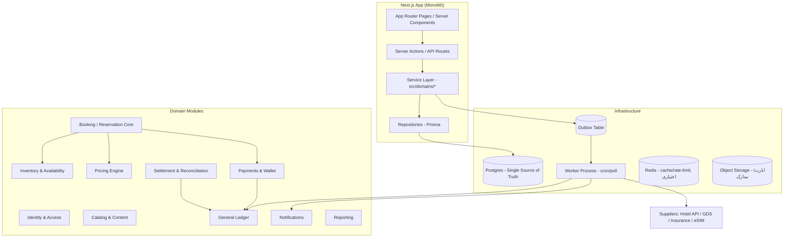
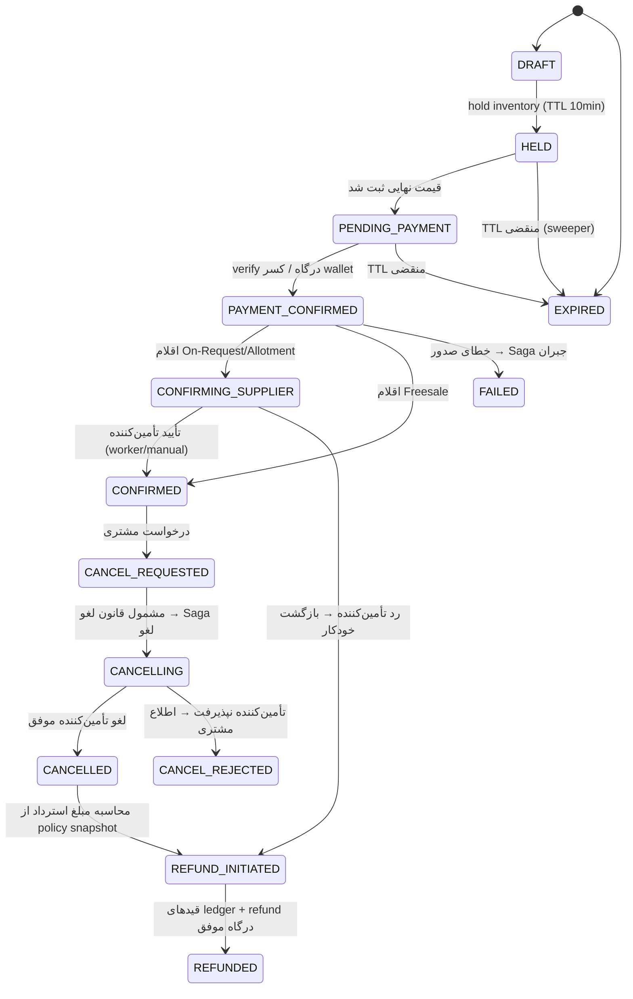
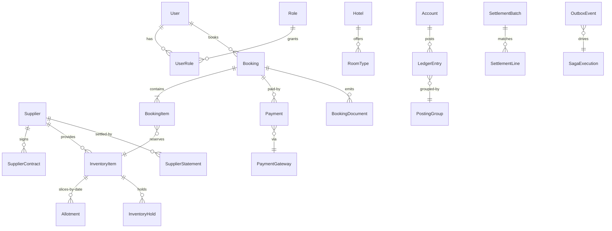

# ماستر پلن ERP پلتفرم iTrip / Firuzo

> نسخه ۱.۰ — سپتامبر ۲۰۲۶
> هدف: تبدیل پلتفرم از یک Booking Frontend با لایه مالی مقدماتی به یک **Travel ERP کامل** که چرخه «فروش → رزرو → تأیید تأمین‌کننده → تسویه → گزارشگری مالی» را بدون دخالت دستی و بدون ناسازگاری دفتری انجام دهد و برای بار و پیچیدگی آینده طراحی شده باشد.

---

## ۰. وضعیت فعلی (بعد از Remediation)

بر اساس بازبینی ۱۷/۲۳ مورد فیکس‌شده:

- ✅ امنیت پایه: bcrypt + seed، قیمت‌گذاری سمت سرور (`pricing/engine.ts` وصل شده)، Ledger برای درگاه شتاب، `DEMO_MODE` gate، سخت‌سازی middleware و config.
- ✅ دیتا: `my-trips` / `wallet` / `account` / `admin` به DB وصل‌اند؛ `my-trips/[id]` واقعی است.
- ✅ ابزار: `tsc` صفر خطا، vitest + Playwright (۵۲ تست)، typecheck/seed اسکریپت‌ها.
- ⚠️ باقی‌مانده (فاز ۰ این پلن): منطق بک‌دور demo در `auth-store.ts` همچنان در bundle کلاینت است؛ `lt.ts` با ~۵۳۸ فراخوانی هنوز لایه i18n سایه است؛ ۴ مدل Prisma (`Supplier`, `InventoryItem`, `Role`, `UserRole`) تعریف شده ولی بلااستفاده‌اند؛ چند ادعای نادرست در `HANDOFF.md`.

**نکته کلیدی:** آن ۴ مدل بلااستفاده دقیقاً هسته ERP آینده‌اند — این پلن آنها را به‌جای حذف، «فعال‌سازی» می‌کند.

---

## ۱. درس‌های تحقیق (از ERPهای موجود و الگوهای صنعت)

| منبع تحقیق | درس قابل استفاده در iTrip |
|---|---|
| ERPهای آژانس (Travel Booster, TRAACS, FlightsLogic, AltexSoft) | قلب هر Travel ERP یک **Reservation Engine مرکزی** است که همه چیز (مسافر، تاریخ، تأمین‌کننده، مالی) به آن گره خورده؛ بقیه ماژول‌ها دور آن می‌چرخند. مفهوم «Travel File» (پرونده سفر) که همه اقلام یک سفر را یک‌جا نگه می‌دارد. |
| Channel Manager ها (RateGain, Planet, Aiosell) | جلوگیری از overselling فقط با **کاهش فوری و اتمیک موجودی در همه کانال‌ها** + مکانیزم **Stop-Sell** ممکن است؛ sync تأخیری = فروش مجدد اتاق. |
| الگوی Reservation/Hold (CodeOpinion, Redis, Kleppmann) | جریان درست `hold → confirm / release` با **TTL و sweeper** به‌جای قفل بلندمدت. قفل lease بدون fencing token ناامن است؛ در سطح DB، decrement اتمیک با optimistic locking کافی و ساده‌تر است. |
| Saga و State Machine (microservices.io, DZone flight booking, Temporal) | سفارش در وضعیت `PENDING` متولد می‌شود و هر گام saga (پرداخت، تأیید تأمین‌کننده، صدور) یک **جبران‌ساز (compensation)** مشخص دارد؛ orchestration مرکزی از choreography پراکنده قابل‌ردیابی‌تر است. |
| دفتر دوطرفه (balanced.software, SDK.finance, systemdesignsandbox) | Ledger باید **append-only** باشد؛ اصلاح فقط با قید معکوس؛ توازن DEBIT=CREDIT باید با constraint تضمین شود؛ **Idempotency Key** برای جلوگیری از ثبت مضاعف حیاتی است (کلید داخل `Date.now()` ساختن = غیرایده‌مپوتنت). |
| چندارزی (Mathews Wong, Dynamics GP, Acumatica, dev.to) | **نرخ ارز باید روی خود رکورد تراکنش ذخیره شود** نه lookup در لحظه گزارش؛ تفکیک Rate Type؛ سود/زیان ارزی واقعی و غیرواقعی (realized/unrealized) با job دوره‌ای (Revaluation). |
| Temporal / Outbox | برای مقیاس فعلی، **DB Outbox + Worker دوره‌ای** کافی و بسیار ساده‌تر از موتور اجرای پایدار است؛ Temporal فقط وقتی توجیه دارد که تعداد sagaهای پیچیده روزانه به هزاران برسد. |

**نتیجه معماری:** Modular Monolith داخل Next.js با مرزهای سخت دامنه‌ای (`src/domains/*`)، یک Worker جدا برای کارهای پس‌زمینه، و DB (Postgres) به‌عنوان تنها منبع حقیقت. میکروسرویس الان ممنوع.

---

## ۲. نمای کلان معماری



**قوانین سخت معماری (Non-negotiables):**
1. **Server Action هیچ SQL/کسب‌وکاری ندارد** — فقط auth + validate + فراخوانی Service + serialize پاسخ. منطق در `src/domains/<module>/` است تا از UI و از Action هر دو قابل استفاده باشد.
2. **کلاینت هرگز عدد پولی یا وضعیت booking نمی‌送** — فقط شناسه (`itemId`, `planId`). همه چیز server-side resolve می‌شود.
3. **Ledger append-only** — هیچ update/delete روی `LedgerEntry`، حتی برای admin. اصلاح = قید reversing.
4. **هر وضعیت‌گذاری booking فقط از طریق `BookingStateMachine`** — هیچ `prisma.booking.update({status})` پراکنده.
5. **هر эффект جانبی (ایمیل، SMS، فراخوانی تأمین‌کننده) از Outbox** — نه inline در transaction اصلی.

---

## ۳. ماژول‌ها و مسئولیت‌ها

### 3.1 Identity & Access (فعال‌سازی Role/UserRole موجود)
- `User` + `Role` + `UserRole` (مدل‌های موجود) با **Permission Strings** در `Role.permissions` (JSON): مثلاً `booking:refund`, `finance:reports:view`, `catalog:hotels:edit`.
- Middleware فقط gate سطح مسیر را نگه می‌دارد؛ **چک نهایی permission در Service Layer** (defense in depth) با تابع `requirePermission(user, 'finance:refund')`.
- نقش‌های پایه seed: `SUPER_ADMIN`, `FINANCE`, `OPS`, `SUPPORT`, `CUSTOMER`. تفکیک نقش از permission از الان تا بعداً بتوان نقش سفارشی ساخت.
- KYC: اسناد در S3 (آدرس‌striped)، وضعیت در DB. داده KYC از localStorage حذف شود (باقی‌مانده فاز ۰).

### 3.2 Catalog & Content
- موجودیت‌ها: `Hotel`, `RoomType`, `Airline`, `Airport`, `Tour`, `Transfer`, `InsurancePlan`, `eSimPlan`, `CityPass`.
- `Hotel` جایگزین mockهای `lib/data.ts` و `hotel-mock.ts` می‌شود؛ ترجمه‌ها با جدول `Translation(entityType, entityId, locale, field, value)` یا ستون‌های JSONB `{fa,en,ar,zh,ru}`.
- رابطه با تأمین‌کننده: هر آیتم کاتالوگ یک `supplierId` دارد.

### 3.3 Supplier & Contract (فعال‌سازی Supplier موجود)
- `Supplier` (موجود) + `SupplierContract`: نوع قیمت‌گذاری (net rate / commission)، اعتبار (credit limit، مهلت تسویه)، درصد لغو، API credentials (رمزنگاری‌شده).
- «مدهای کار» با تأمین‌کننده: **API Real-time** / **Allotment** (سهمیه رزرو شده) / **On-Request** (باید تأیید انسانی بگیرد). این سه mode همه جا از inventory تا booking ثابت نوع‌دهی می‌شوند.

### 3.4 Inventory & Availability Engine (فعال‌سازی InventoryItem موجود)
- سه مدل موجودی:
  - **Freesale**: بی‌نهایت، فقط اعتبارسنجی با API تأمین‌کننده.
  - **Allotment**: سهمیه تاریخ‌مند `Allotment(supplierId, itemType, itemId, date, total, booked, stopSell)`.
  - **On-Request**: موجودی مبهم؛ booking در `CONFIRMING_SUPPLIER` می‌ماند تا پاسخ بیاید.
- **Hold با TTL** (الگوی Reservation): `InventoryHold(id, allotmentId, qty, expiresAt, bookingId?)`. available = total − booked − activeHolds.
- Sweeper هر ۶۰ ثانیه holdهای منقضی را آزاد می‌کند (worker).
- **Stop-Sell** تاریخ‌مند: فروش روی بازه بسته را در سطح query موجودی مسدود می‌کند.

### 3.5 Pricing Engine (تع عمیق `lib/pricing/engine.ts` موجود)
- Pipeline ثابت: `BaseCost → SupplierMarkup → PlatformMarkup(rule) → Fees(fixed/percent) → Tax/VAT → PromoCode → Rounding → Output(priceBreakdown)`.
- `PricingRule(supplierId?, itemType?, dateRange?, channel?): {type, value, priority}` — موتور rules را به ترتیب اولویت اعمال می‌کند و **breakdown کامل** (هر خط با منبعش) برمی‌گرداند؛ همان breakdown هم در `BookingItem.details` ذخیره می‌شود (تاریخچه قیمت immutable).
- Rounding policy: IRR گرد به ۱۰۰۰، USD/AED به ۲ رقم، همیشه **به ضرر پلتفرم نه مشتری** (یک تابع مرکزی، تست‌شده با vitest).

### 3.6 Booking / Reservation Core (قلب سیستم)
- ماشین وضعیت کامل → بخش ۴.
- `Booking` موجود گسترش می‌یابد: `holdId`, `supplierRef`, `cancellationPolicySnapshot`, `documentUrls`.
- «Travel File»: صفحه `/my-trips/[id]` = نمای پرونده: اقلام + اسناد (واچر، بلیط، بیمه‌نامه) + تایم‌لاین وضعیت + مکاتبات.

### 3.7 Payments & Wallet
- درگاه‌ها به‌صورت `PaymentGateway` abstraction: `initiate(payment) → redirect/checkout-url`، `verify(ref) → {ok, gatewayRef, amount}`. هیچ منطق درگاهی در action نیست.
- Idempotency: هر payment با `idempotencyKey` که **کلاینت یکبار تولید می‌کند** (UUID در init فرم) و DB با unique constraint محافظت می‌شود — نه `Date.now()`.
- Wallet = همان Account/Ledger؛ topup واقعی از درگاه → ledger؛ برداشت فقط refund به همان وسیله.
- Refund: قانون لغو از `cancellationPolicySnapshot` زمان booking → محاسبه مبلغ قابل استرداد → قیدهای ledger → فراخوانی refund درگاه (saga با جبران‌ساز).

### 3.8 General Ledger
- Chart of Accounts حداقلی: `CUSTOMER_*`, `PLATFORM_ESCROW`, `PLATFORM_REVENUE`, `PLATFORM_FEE`, `GATEWAY_SETTLEMENT`, `SUPPLIER_PAYABLE_*`, `TAX_PAYABLE`, `FX_GAIN_LOSS`.
- قیدهای استاندارد (Posting Templates) → بخش ۵.۳.
- چندارزی: هر LedgerEntry `currency`, `fxRate` (نرخ لحظه ثبت به ارز پایه IRR), `baseAmount`. **سود/زیان ارزی** در revaluation شبانه روی مانده‌های ارزی غیرپایه.
- گزارش‌های مالی: Trial Balance، گردش حساب، سود ناخالص per booking (sellPrice − netCost).

### 3.9 Settlement & Reconciliation
- تسویه درگاه: فایل/گزارش درگاه (مبلغ ناخالص، کارمزد، واریزی) → `SettlementBatch` → matching با قیدهای `GATEWAY_SETTLEMENT` → مغایرت‌ها به صف OPS.
- تسویه تأمین‌کننده: `SupplierStatement` = تجمیع `netCost` bookingهای CONFIRMED دوره → بررسی اعلامیه تأمین‌کننده → ۳-way match (booking ↔ ledger ↔ اعلامیه) با tolerance.
- مغایرت unmatched بعد از N روز → task خودکار در صف OPS با AuditLog.

### 3.10 Notifications
- همه از Outbox: قالب‌های per-locale (ایمیل/SMS) با متغیرهای booking. retry با backoff، DLQ بعد از ۵ تلاش، صف مشاهده‌پذیر در admin.

### 3.11 Reporting & Admin Ops Console
- داشبورد: فروش روز/ماه به تفکیک محصول، margin واقعی، نرخ لغو، مانده تأمین‌کنندگان، مغایرت‌های باز.
- صف‌های عملیاتی: on-requestها، مغایرت‌های تسویه، refundهای نیازمند بررسی، holdهای منقضی مشکوک. هر اکشن دستی → AuditLog الزامی.

---

## ۴. ماشین وضعیت Booking (الگوریتم مرکزی)



**جدول انتقال‌ها (قرارداد پیاده‌سازی):** هر انتقال = `{from[], to, guard(), sideEffects[], compensation}` در یک فایل واحد `domains/booking/state-machine.ts`. guardها: مالکیت، وضعیت، TTL، موجودی. sideEffects: قید ledger، Outbox event، Release/Capture hold. هیچ مسیر دیگری برای تغییر `status` وجود ندارد (تست واحد این invariant را با grep در CI می‌سنجد).

---

## ۵. الگوریتم‌های کلیدی (شبه‌کد)

### ۵.۱ Hold موجودی (اتمیک، بدون oversell)
```
function createHold(itemId, date, qty, ttl=10min):
  tx:
    allotment = SELECT ... FOR UPDATE / یا UPDATE با version (optimistic)
    available = allotment.total - allotment.booked - sum(activeHolds)
    if dateInStopSell(date) or available < qty: return REJECTED
    INSERT InventoryHold(qty, expiresAt=now+ttl, token=uuid)
  return token   // کلاینت فقط token دارد
```
- نکته هم‌زمانی: در Postgres با `UPDATE allotments SET booked=booked+... WHERE id=? AND total-booked-activeHolds>=qty RETURNING` یک‌خطی حل می‌شود؛ در SQLite فعلی تراکنش serial است و مشکل race ندارد — در migration به Postgres همین الگو حفظ شود.
- confirm hold: `expiresAt > now` + انتقال وضعیت؛ release: sweeper یا صریح.
- Fencing: هر مصرف hold باید `token` را ببیند — بعد از expiry مصرف token نامعتبر است.

### ۵.۲ Pricing (سمت سرور، Breakdown Immutable)
```
price(item, dates, pax, channel):
  cost   = supplierNet(item, dates)              // از Contract/Allotment
  rules  = activePricingRules(item, dates, channel) // مرتب با priority
  price  = rules.reduce(applyRule, cost)          // markup/fee/tax
  price  = applyPromo(price, promoCode?)
  price  = roundByCurrency(price)
  return {total, lines:[{label, amount, source}]} // source: ruleId/taxCode
```
- Breakdown عیناً در `BookingItem.details.pricing` ذخیره می‌شود → دفاع در هر اختلاف/audit.

### ۵.۳ قیدهای Ledger استاندارد (Posting Templates)
| رویداد | Debit | Credit | نکته |
|---|---|---|---|
| پرداخت wallet | CUSTOMER_ACCOUNT | PLATFORM_ESCROW | هر دو هم‌ارز |
| پرداخت درگاه | GATEWAY_SETTLEMENT | PLATFORM_ESCROW | بعد از verify |
| کارمزد درگاه | PLATFORM_FEE_EXPENSE | GATEWAY_SETTLEMENT | از فایل تسویه |
| فروش تحقق‌یافته | PLATFORM_ESCROW | PLATFORM_REVENUE + TAX_PAYABLE | در لحظه CONFIRMED |
| بدهی تأمین‌کننده | PLATFORM_REVENUE(=netCost) | SUPPLIER_PAYABLE | در لحظه CONFIRMED |
| تسویه تأمین‌کننده | SUPPLIER_PAYABLE | BANK | با SettlementBatch |
| refund به مشتری | PLATFORM_ESCROW | CUSTOMER_ACCOUNT | بر اساس policy |
| سود/زیان ارزی | FX_GAIN_LOSS | CUSTOMER/حساب ارزی | job شبانه revaluation |
- Invariant: در هر `groupId` جمع DEBIT = جمع CREDIT؛ constraint سطح DB + تست شبانه ناظر.

### ۵.۴ Saga تأیید رزرو (orchestrated)
```
saga confirmBooking(b):
  step 1: verifyPayment      → جبران: refund درگاه
  step 2: confirmWithSupplier (فreesale=skip, on-request=API/task)
                              → جبران: cancelWithSupplier
  step 3: postRevenueEntries → جبران: reversing entries
  step 4: emit BOOKING_CONFIRMED → واچر + ایمیل
  هر خطا: اجرای جبران‌های گام‌های گذشته به ترتیب معکوس، وضعیت FAILED/REFUND_INITIATED
```
- اجرا: Worker روی Outbox با جدول `SagaStep(sagaId, step, state)` — قابل ازسرگیری بعد از crash؛ Temporal فقط در آینده.

### ۵.۵ Reconciliation (سه‌طرفه)
```
match(batch):
  A = قیدهای ledger آن دوره        B = فایل درگاه/اعلامیه تأمین‌کننده
  key = (gatewayRef|supplierRef, amount, currency)
  exact → matched ; |Δ|<=tolerance → matched-with-note ; بقیه → OPS queue
  KPI: مغایرت باز > 3 روز = alert
```

---

## ۶. مدل داده (ERD خلاصه — تکامل اسکیمای موجود)



مهم‌ترین تغییرات اسکیما نسبت به الان:
- `Booking`: + `holdToken`, `stateHistory` (JSON)، `policySnapshot`، رابطه اختیاری به `Organization` (B2B آینده).
- `Payment` جدول مستقل می‌شود (الان فقط ledger هست) با `gatewayRef`, `idempotencyKey @unique`, `status`, `rawPayload`.
- `Allotment` و `InventoryHold` و `StopSellPeriod` جدید.
- `Role/UserRole/Supplier/InventoryItem` از «مرده» به «هسته» تبدیل می‌شوند.
- Migration مسیر: SQLite → Postgres با `prisma migrate` از همین الان (فاز ۱) تا تاریخچه migration سالم باشد.

---

## ۷. ماتریس دسترسی (نمونه)

| Permission | SUPER_ADMIN | FINANCE | OPS | SUPPORT |
|---|---|---|---|---|
| `booking:view:all` | ✅ | ✅ | ✅ | ✅ |
| `booking:confirm:on-request` | ✅ | ❌ | ✅ | ❌ |
| `booking:refund:approve` | ✅ | ✅ | ❌ | ❌ |
| `finance:reports:view` | ✅ | ✅ | ❌ | ❌ |
| `finance:settlement:match` | ✅ | ✅ | ❌ | ❌ |
| `catalog:*:edit` | ✅ | ❌ | ✅ | ❌ |
| `ops:override:cancel` | ✅ | ❌ | ✅ | ❌ |

---

## ۸. نقشه راه اجرا

| فاز | محتوا | خروجی قابل تحویل | معیار پذیرش |
|---|---|---|---|
| **۰. بدهی باقی‌مانده** (۱-۲ روز) | حذف کامل بک‌دورهای `auth-store` از bundle؛ migration فاز اول `lt.ts` (۱۰ فایل سنگین)؛ اصلاح ادعاهای HANDOFF؛ migrate به Postgres + تاریخچه migration | bundle بدون منطق auth demo؛ DB روی Postgres | grep بک‌دور = صفر؛ `prisma migrate dev` پاس؛ CI سبز |
| **۱. هسته ERP** (۱-۲ هفته) | فعال‌سازی Role/Permission در Service Layer؛ جدول Payment با idempotency؛ Posting Templates به‌صورت توابع تست‌شده؛ Ledger invariant constraint | ثبت مالی همه رویدادها با قالب استاندارد | هر groupId متوازن؛ تست واحد قیدها سبز |
| **۲. Inventory و Hold** (۱-۲ هفته) | Allotment/InventoryHold/StopSell + sweeper + اتصال Pricing به Contract | جریان hold→confirm واقعی | تست هم‌زمانی (۲ hold موازی، حداکثر ظرفیت) سبز؛ هیچ oversell |
| **۳. ماشین وضعیت + Saga** (۲ هفته) | state-machine.ts + SagaExecution روی Outbox + worker؛ صفحه Travel File با تایم‌لاین و اسناد | رزرو end-to-end با اقلام on-request و لغو/استرداد قانون‌مند | kill worker وسط saga → بعد از restart ادامه صحیح یا جبران کامل |
| **۴. Settlement & Reconciliation** (۱-۲ هفته) | SettlementBatch + matching + صف OPS + گزارش‌های مالی پایه | trial balance، گردش حساب، مغایرت‌ها | match سه‌طرفه روی داده آزمایشی با مغایرت عمدی |
| **۵. Catalog و مهاجرت محتوا** (۱-۲ هفته) | مدل‌های Hotel/RoomType/Tour + جدول ترجمه؛ حذف کامل mockهای `lib/data.ts` | صفحات از DB با i18n کامل | حذف `lt.ts` به‌طور کامل؛ صفر MISSING_MESSAGE در ۵ زبان |
| **۶. اتصال تأمین‌کننده واقعی** (وابسته به قرارداد) | آداپتور ۱ تأمین‌کننده هتل (API real-time) + ۱ درگاه واقعی | فروش واقعی end-to-end | reconciliation روزانه بدون مغایرت دستی |
| **۷. بلوغ** | SLO، observability (trace روی saga)، B2B/Organization، Temporal در صورت نیاز، پشتیبان‌گیری/DR | SLA عملیاتی | recovery drill موفق |

**قاعده هر فاز:** شاخه‌گذاری، تست واحد برای هر الگوریتم بخش ۵، به‌روزرسانی `ARCHITECTURE_DEBT.md` و Remediation Log در HANDOFF.

---

## ۹. ریسک‌ها و تدابیر

| ریسک | احتمال | تدبیر |
|---|---|---|
| Overselling هنگام هم‌زمانی | متوسط | hold اتمیک + تست هم‌زمانی در CI + سقف oversell=0 |
| ثبت مضاعف مالی با retry | بالا | idempotencyKey unique در Payment و PostingGroup |
| ناسازگاری ledger و وضعیت booking | متوسط | فقط state machine وضعیت عوض می‌کند؛ تست شبانه توازن |
| قفل شدن روی SQLite با رشد | قطعی در آینده | migration فاز ۰ همین حالا |
| تورم scope (ساخت SAP!) | بالا | قانون: هر فیچر قبل از merge باید «کدام قید بخش ۲ و کدام template بخش ۵.۳» را پاس کند |
| داده demo با production مخلوط | متوسط | حذف تدریجی DEMO_MODE؛ env جدا + seed جدا؛ تا فاز ۶ دمو فقط روی DB محلی |

---

## ۱۰. تعریف «تمام شد» (Definition of Done برای کل پلن)

1. هیچ عدد پولی یا وضعیتی از کلاینت قابل دستکاری نیست (تست نفوذ داخلی مستند).
2. هر booking در هر لحظه: وضعیت معتبر + ledger متوازن + document کامل + audit trail.
3. مغایرت مالی به‌طور خودکار کشف و در صف OPS می‌افتد، نه توسط مشتری.
4. شروع یک رزرو on-request با قطع وسط هر گام (crash test) هرگز به «پول گرفته و رزرو نه» یا برعکس نمی‌رسد.
5. گزارش سود ناخالص هر booking با breakdown قابل ردیابی تا rule و contract تأمین‌کننده.
6. صفحات مشتری و ادمین همه از DB با i18n کامل ۵ زبان، بدون لایه i18n سایه.

---

## منابع تحقیق

- Travel ERP module taxonomy: [FlightsLogic](https://www.flightslogic.com/travel-erp-software-solution.php), [Travel Booster](https://travelbooster.com), [TRAACS](https://traacs.in), [AltexSoft](https://altexsoft.com), [COAX](https://coaxsoft.com)
- Channel/Inventory: [RateGain](https://rategain.com/blog/how-to-avoid-overbooking-channel-manager-best-practices/), [Planet](https://www.weareplanet.com/blog/hotel-inventory-management), [Aiosell](https://aiosell.com/blog/prevent-overbookings/), [ChannelRush Stop-Sell](https://www.channelrush.com/hospitality-glossary/hotel-stop-sell)
- Reservation/Hold/Lease: [CodeOpinion Reservation Pattern](https://codeopinion.com/avoiding-distributed-transactions-with-the-reservation-pattern/), [Redis Inventory Reservation](https://redis.io/tutorials/inventory-reservation-in-real-time-with-redis/), [Kleppmann on Distributed Locking](https://martin.kleppmann.com/2016/02/08/how-to-do-distributed-locking.html), [Lease Pattern](https://singhajit.com/distributed-systems/lease/)
- Saga/State Machine: [microservices.io Saga](https://microservices.io/patterns/data/saga.html), [DZone Flight Booking Saga](https://dzone.com/articles/saga-state-machine-flight-booking), [Temporal Saga Guide](https://temporal.io/blog/mastering-saga-patterns-for-distributed-transactions-in-microservices), [System Design Academy](https://www.systemdesignacademy.com/blog/saga-pattern-distributed-transactions)
- Double-entry Ledger: [Balanced.software](https://www.balanced.software/double-entry-bookkeeping-for-programmers/), [SDK.finance](https://sdk.finance/blog/what-is-a-double-entry-ledger-in-fintech/), [System Design Sandbox](https://www.systemdesignsandbox.com/learn/double-entry), [Anvil Guide](https://anvil.works/blog/double-entry-accounting-for-engineers)
- Multi-currency: [Mathews Wong — Multi-Currency in Custom ERP](https://www.matthewswong.com/en/blog/erp-multi-currency-accounting/), [Storing FX Rates on Transactions](https://dev.to/doogal/storing-exchange-rates-for-multi-currency-systems-50m2), [Dynamics GP Multicurrency](https://learn.microsoft.com/en-us/dynamics-gp/financials/multicurrencymanagement), [Acumatica](https://www.acumatica.com/blog/multi-currency-accounting/)
