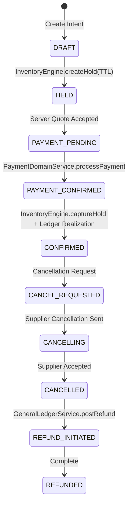

# Architecture: Double-Entry General Ledger & Saga Orchestration

This document defines the formal financial accounting and transactional booking architecture implemented in the iTrip / Firuzo platform.

---

## 1. Double-Entry General Ledger (GeneralLedgerService)

Every monetary transaction follows the strict double-entry invariant:

$$\sum \text{DEBIT} \equiv \sum \text{CREDIT}$$

No single-legged balance update is ever executed directly against user balances. All balance queries are projections derived from ledger entries.

### Chart of Accounts & Owner Types
| Owner Type | Purpose | Normal Balance |
| :--- | :--- | :--- |
| `USER` | Customer wallet liabilities | Credit |
| `PLATFORM_ESCROW` | Unearned booking revenue held in escrow | Credit |
| `GATEWAY_SETTLEMENT` | Receivables due from payment service providers | Debit |
| `SUPPLIER_PAYABLE` | Obligations owed to fulfillment suppliers | Credit |
| `PLATFORM_REVENUE` | Net earned platform commission and fees | Credit |
| `TAX_PAYABLE` | VAT and tax obligations owed to tax authorities | Credit |
| `FX_POOL` | Currency exchange clearing buffer | Balanced |

---

## 2. Standard Posting Templates

### Template 0: Wallet Top-Up
When funds are deposited into a customer wallet:
```
DR  GATEWAY_SETTLEMENT  [Amount]  (PSP owes platform the funds)
CR  USER                [Amount]  (Platform owes customer the wallet balance)
```

### Template 1: Booking Payment (Wallet or Gateway)
When a booking is paid:
```
DR  USER / GATEWAY_SETTLEMENT  [Total Amount]
CR  PLATFORM_ESCROW             [Total Amount]
```

### Template 2: Revenue Realization & Settlement
Upon fulfillment confirmation by supplier:
```
DR  PLATFORM_ESCROW   [Total Amount]
CR  SUPPLIER_PAYABLE  [Net Cost]
CR  TAX_PAYABLE       [Tax Amount]
CR  PLATFORM_REVENUE  [Platform Fee + Markup]
```

### Template 3: Refund
When a booking is cancelled and funds are returned:
```
DR  PLATFORM_ESCROW  [Refund Amount]
CR  USER             [Refund Amount]
```

---

## 3. Booking Saga Orchestrator (`BookingSagaOrchestrator`)

To coordinate external systems (PSP, Inventory Allotment, Ledger, Notification) without long-held locks or distributed commit deadlocks, the system uses a Saga with compensating actions.



### Isolation & Concurrency
- `createHold` and `confirmBookingSaga` execute at `isolationLevel: Serializable` to prevent oversell race conditions on scarce inventory allotments.
- If inventory is exhausted, `createHold` fails closed without debiting any payment.
- If payment fails, any active inventory hold expires automatically via TTL or is explicitly released.
