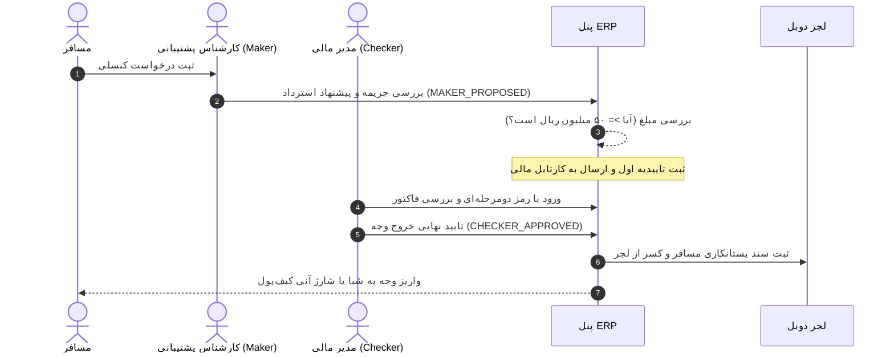

# راهنمای عملیاتی گردش‌کار تایید استرداد و فرآیند Maker-Checker (Runbook 04: Refund Escalation)
**کد رخداد در سیستم:** `EXCEPTION_REFUND_SLA_BREACH`  
**سطح بحران:** P2 / عملیاتی  
**مخاطب:** کارشناسان پشتیبانی سفر (Maker)، مدیران مالی ERP (Checker)  

---

## ۱. قوانین حاکم بر استرداد وجه و آستانه مبالغ بالا
- طبق قانون **ERP-010 / FIN-009**:
  * استردادهای زیر ۵۰ میلیون ریال با تایید یک مرحله‌ای سیستم یا کارشناس انجام می‌شوند.
  * **استردادهای برابر یا بالاتر از ۵۰ میلیون ریال (`>= 50,000,000 IRR`)** الزاماً نیازمند تایید دو فرد کاملاً مستقل هستند:
    1. **Maker (کارشناس رزرواسیون):** بررسی کنسلی هتل/پرواز و استعلام جریمه طبق قوانین ایرلاین.
    2. **Checker (مدیر مالی):** تایید شماره شبای مسافر، بررسی کسر سهمیه و مجوز واریز بانکی پایا.

---

## ۲. گام‌های فرآیند دو مرحله‌ای Maker-Checker

---

## ۳. نحوه برخورد با تاخیر استرداد (SLA Escalation > 24 Hours)
- اگر درخواستی بیش از ۲۴ ساعت در صف `PENDING_APPROVAL` بماند:
  1. اعلان پیامکی خودکار به مدیر مالی ارسال می‌شود.
  2. در داشبورد لاگ `Refund Operational SLA` رنگ وضعیت به قرمز تغییر می‌کند.
  3. کارشناس پشتیبانی موظف است با تماس تلفنی علت تاخیر را به مسافر اطلاع دهد تا از ثبت شکایت در درگاه‌های بیرونی جلوگیری شود.
