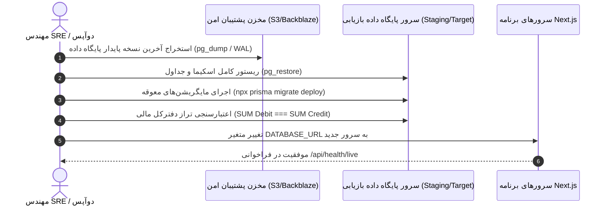

# راهنمای مانور بازیابی پس از بحران و تداوم کسب‌وکار (Runbook 05: Disaster Recovery Drill)
**کد مانور:** `DR_DRILL_CANONICAL_RECOVERY`  
**سطح بحران:** بازسازی کامل زیرساخت (Full Recovery Simulation)  
**دوره بازنگری:** فصلی (هر ۹۰ روز یک‌بار)  
**تعهدات بحران (SLA/Objectives):**
* **RTO (Recovery Time Objective):** حداکثر ۳۰ دقیقه تا بازگشت کامل سرویس رزرواسیون.
* **RPO (Recovery Point Objective):** حداکثر ۵ دقیقه از دست رفتن داده (مبتنی بر لاگ‌های تراکنش PostgreSQL WAL).

---

## ۱. سناریوهای بحران مورد آزمایش در مانور (Simulated Disasters)

1. **از دست رفتن کامل کلاستر دیتابیس اصلی (Total Database Failure)**
2. **فساد داده در صف ورکر و کرش همزمان سرویس‌ها (Worker Outbox Crash)**
3. **قطعی گسترده دیتاسنتر یا ارائه‌دهنده هاستینگ (Datacenter Failover)**

---

## ۲. گام‌های اجرایی بازیابی پایگاه داده (Database Restoration Procedure)



### دستورات ترمینال برای ریستور دیتابیس:
```bash
# ۱. بازیابی فایل پشتیبان رمزنگاری‌شده
openssl enc -d -aes-256-cbc -in backup_latest.dump.enc -out backup_clean.dump

# ۲. بازنشانی پایگاه داده در اینستنس جدید
pg_restore -h target-db.firuzo.internal -U postgres -d itrip_production -v --clean backup_clean.dump

# ۳. اعمال آخرین مایگریشن‌های پریزما
npx prisma migrate deploy

# ۴. اجرای اسکریپت تایید صحت و تراز مالی لجر
node scripts/verify_ledger_balance.mjs
```

---

## ۳. بازیافت صف کارهای ناتمام (Worker & Outbox Recovery)

هنگامی که سرور ناگهان خاموش شود، ممکن است کارهایی در جدول `OutboxTask` یا `SagaExecution` در حالت `CLAIMED` یا `IN_PROGRESS` باقی مانده باشند.  
موتور بازیابی فیروزه بر اساس الگوریتم زیر عمل می‌کند:

1. **شناسایی کارهای زمان‌گذشته (Zombie Tasks):**  
   رکوردهایی که بیش از ۱۰ دقیقه پیش قفل شده‌اند اما نتیجه‌ای ثبت نکرده‌اند:
   ```sql
   UPDATE "OutboxTask"
   SET status = 'PENDING', "lockedAt" = NULL, "lockedBy" = NULL
   WHERE status = 'CLAIMED' AND "lockedAt" < NOW() - INTERVAL '10 minutes';
   ```
2. **شروع خودکار ورکر با قفل سطری ایمن:**
   ```bash
   npm run worker
   ```
   ورکر با دستور `SELECT ... FOR UPDATE SKIP LOCKED` رکوردهای آزادشده را برداشته و بدون خطر تکرار (با کلید Idempotency) عملیات را تا صدور بلیط یا جبران خسارت به پایان می‌رساند.

---

## ۴. چک‌لیست تأیید سلامت پس از بازیابی (Post-Recovery Verification Checklist)

- [ ] فراخوانی موفق اندپوینت سلامت: `GET /api/health/live` با پاسخ `{ status: "UP" }`
- [ ] اعتبارسنجی تراز صفر در لجر: `LedgerImbalanceEvents === 0`
- [ ] اتصال سالم به تأمین‌کنندگان: `GET /api/suppliers/health`
- [ ] انجام یک رزرو تستی کامل (Sanity Test) از جستجو تا صفحه پرداخت در محیط سندباکس.
- [ ] تغییر DNS یا روتینگ کلودفلر/ورسل به زیرساخت بازیابی‌شده.
